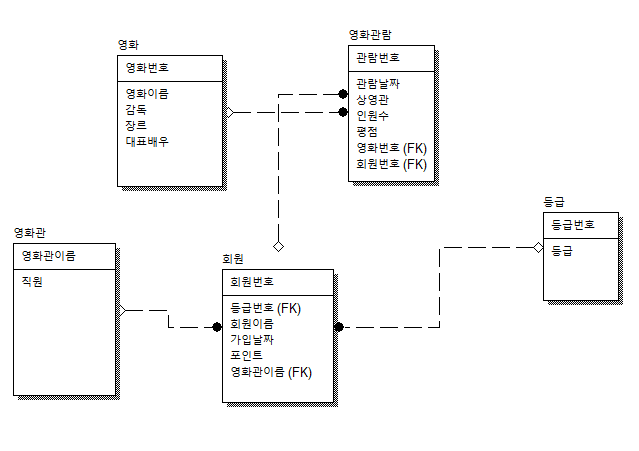
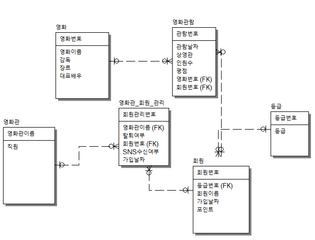
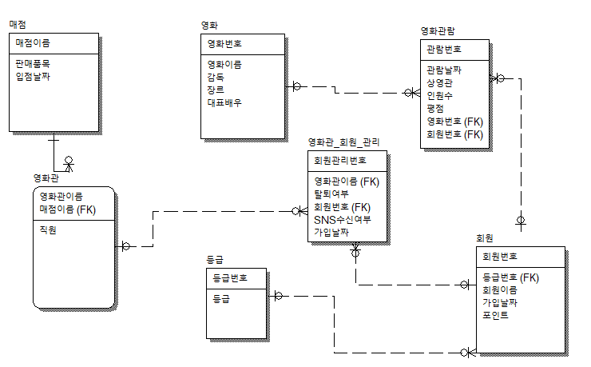
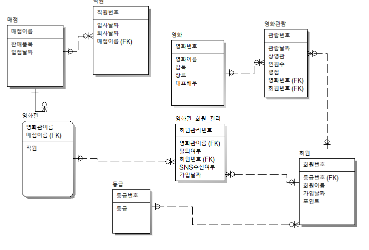
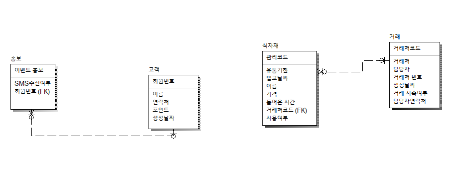

1. 1:N  
반:학생  
팀:선수

2. 1:1  
 군인:총기

3. N:N  
요리사:재료

역 정규화  
데이터가 적으면 테이블을 합쳐 null을 허용

순서
1. 테이블 설계
2. 정규화
3. 역 정규화(선택)
4. 분산저장(선택)  
->두개의 컴퓨터에 나누어서 데이터를 저장  
두 테이블을 주기적으로 동기화  
권한을 나누어서 지정(replication)

요구사항) 회원은 여러 영화관에 가입할수 없다

1. 영화관 테이블에 회원번호가 있으면 다른 회원은 해당 영화관에 가입할수 없다.
2. 회원 테이블에 영화관번호가 PK면 다른회원도 역시 해당 영화관에 가입할수 없다.
3. 회원 테이블에 영화관 번호가 FK되어 있어야함

요구사항) 회원은 여러 영화관에 가입할수 있다.
1. 회원은 여러 영화관 선택가능
2. 영화관은 여러 회원을 받을 수 있음

요구사항) 영화관에 매점을 오픈하려고 한다  
하지만 매점은 오직 하나의 영화관에만 소속될수 있다.  
영화관도 매점 한개만 오픈할수 있다.

요구사항) 이제 매점이 오픈되었다  
직원을 채용해야 합니다  
매점은 여러 직원을 채용할수 있고,  
직원은 이중취업이 불가능 합니다

요구사항) 직원은 매점 여러군데 에서 일할수 있다
매점은 여러 직원을 채용할수 있다

개인 카페 관리 시스템  
상원이는 카페를 차렸다.  
혼자 카페를 관리하는 DB시스템을 만들려고 한다.  
*** 요구 사항은 아래와 같다.
1. 고객 데이터는 이름, 연락처, 포인트만 필요하다.
   카페 정보,메뉴 정보 데이터는 DB로 관리 X

2. 포인트가 1000점이 넘는 고객들은 매달 SMS로 이벤트
홍보를 보내고 싶고, 그 기록을 DB에 남기고 싶다.

3. 카페에 들어오는 식자재를 DB로 관리하고 싶다.
   언제 들어 왔는지 유통기한은 언제까지인지 등등

4. 식자재 거래처도 DB로 관리하고 싶다.

SQL은 Structured Query Language (구조적 질의 언어)의 줄임말로, 관계형 데이터베이스 시스템(RDBMS)에서 자료를 관리 및 처리하기 위해 설계된 언어