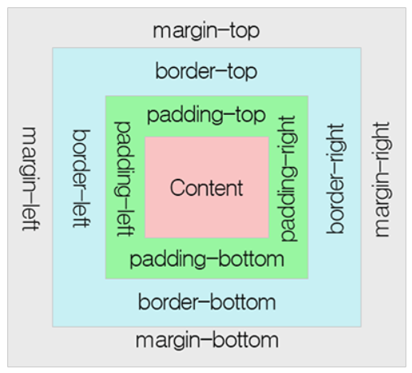

1. 브라우저 렌더링 원리 (https://d2.naver.com/helloworld/59361)

   -  1. DOM, CSSOM생성: 가장 첫번째 단계로 서버로부터 받은 HTML, CSS를 다운받는다 → 단순한 텍스트인 HTML, CSS파일을 Object Model로 만든다. HTML은 DOM으로, CSS는 CSSOM으로 만들어진다. (html이 여기서 파싱된다)
      DOM Tree와 CSSOM Tree가 만들어진다
       2. Render Tree생성: DOM Tree와 CSSOM Tree가 만들어졌으면 그 다음으로는 이 둘을 이용하여 Render Tree를 생성한다. 렌더트리에는 스타일 정보가 설정되어있고, 실제 화면에 표현되는 노드들로 구성된다. 
      3. Layout 단계: 브라우저의 뷰포트(Viewport) 내에서 각 노드들의 정확한 위치와 크기를 계산한다. 생성된 Render Tree 노드들이 가지고 있는 스타일과 속성에 따라서 브라우저 화면의 어느위치에 어느크기로 출력될지 계산하는 단계이다.(reflow 단계) 레이아웃 단계에서 %, vh, vw와 같이 상대적인 위치, 크기 속성은 실제 화면에 그려지는 픽셀 단위로 변환된다. 
      4. Paint: Layout 계산이 완료되면 이제 요소들을 실제 화면을 그리게 된다.(repaint 단계) 처리해야하는 스타일이 복잡할수록 paint 단계에 소요되는 시간이 길다. (가령 그라데이션, 그림자 효과 > 단색 배경) 

2. 호이스팅에 대해 설명해보시오

 - 호이스팅은 변수를 선언하고 초기화했을 때, 선언 부분이 최상단으로 끌어올려지는 현상을 말한다. var의 경우 변수를 선언하고 초기화하는 과정이 동시에 일어나서 호이스팅이 발생한다. 반면 let/const 의 경우 선언과 초기화 단계가 동시에 일어나지 않는다. 실행 시점에서 실제 선언부를 만날 때 초기화가 이뤄진다. 그 사이의 시간을 TDZ(Temporary Dead Zone)이라고 한다. 즉 실행 컨텍스트에 변수가 선언은 되었으나 메모리가 할당되지 않아 ReferenceError가 발생한다.  함수 호이스팅은 선언문에서 발생한다. 선언된 함수는 상단에서 참조, 호출이 가능하다. 함수 표현식은 결국 변수에 할당하는 모습이라 변수 호이스팅의 사례로 볼 수 있다. 

(변수 선언 3단계: 선언 -> 초기화 -> 할당)

3. 클로저는 무엇인가요? 원리와 왜 사용하는지? 

  - 클로저란 함수와 해당 함수가 선언된 렉시컬 환경의 조합이다. 외부 함수가 반환된 후에도 외부 함수의 변수 범위 체인에 접근할 수 있는 함수이다. 전역 변수의 사용을 억제하고, 정보를 은닉하기 위해 사용한다. 

4. this의 용법을 아는대로 설명하시오

 - This는 함수를 호출할 때 결정되는 것이다. 전역범위에서 사용될 때 this는 전역객체를 가르킨다. 함수에서 사용될때도 전역객체를 가르킨다. 객체에 속한 메서드에서 사용될때 그 메서드의 객체(점 앞에 명시된 객체)를 가르킨다. 객체에 속한 메서드의 내부함수에서 사용될땐 전역객체를 가르킨다. 생성자에서 사용될때 생성자로 인해 생성된 새로운 객체를 가리킨다.

5. 브라우저 저장소에 대한 차이점을 설명해주세요

  - key-value형태의 만료기한이있는 쿠키의 단점을 보완해 웹스토리지(로컬과 세션)가 만들어졌다. 로컬 스토리지는 클라이언트의 정보를 영구적으로(자동로그인) 저장하는 반면 세션 스토리지는(비로그인 장바구니) 브라우저를 닫을 경우 정보가 삭제된다. 쿠키는 로컬&세션에 비해 용량이 매우작고, 치명적인 단점에는 암호화가 없어 정보 도난 위험이있다.  

6. 이벤트 버블링에 대해 말씀해주세요

 - 이벤트 버블링은 어떤 요소에 대한 이벤트가 발생했을 때, 해당 요소의 최상위 부모까지 이벤트가 전달되어지는 과정이다. HTML 구조상 자식 요소에 발생한 이벤트가 상위 부모요소에 영향을 미치는 것이다. 이벤트 캡쳐링과 정반대이다. (최상위 부모에서 이벤트 발생 요소까지 이벤트 전달 되는 것) 
 이벤트 버블링이나 캡처링을 차단 하고 싶을때 e.stopPropagation을 호출하면 이벤트 전파를 막고 해당 이벤트만 실행시킬 수 있다. 

7. 타입스크립트 사용해본 적 있는지? 어떤가요?

- 타입스크립트는 자바스크립트 기반의 언어이며 자바스크립트의 상위확장버전이다다. 정적타입으로 컴파일 단계에서 오류를 포착할 수 있는 장점이 있고, 강력한 객체지향 프로그래밍을 지원합니다. ES6의 새로운 기능들을 사용하기 위해 바벨과 같은 별도 트랜스파일러를 사용하지 않아도 ES6의 새로운 기능을 기존의 자바스크립트 엔젠에서 실행 가능하다. 명시적인 정적 타입 지정은 코드의 가독성을 높이고 디버깅을 쉽게 한다.

8. CSR과 SSR의 차이점은 무엇인가요?

 - SSR은 사용자가 웹 페이지에 접근 할때, 서버에 각각 페이지에 대해 요청하고 서버에서 HTML, JS 파일등을 모두 다운로드하여 화면에 렌더링 하는 방식이다. CSR은 클라이언트측에서 HTML을 반환한 후에, JS가 동작하면서 데이터만을 주고받아 클라이언트에서 렌더링을 진행하는 것이다. 

초기로딩속도 측면에서, SSR은 CSR에 비해 다운받는 파일이 많지 않아 속도가 빠른 반면, CSR은 모든 JS파일을 다운 받아와야 하기 때문에 초기에 오래걸린다.
서버 부담측면에서, SSR은 서버와 잦은 응답(View가 바뀔 때마다 서버에 요청)을 하기 때문에 서버에 부담이 되고 UX측면이 떨어진다(새로고침 많음), CSR은 데이터 요청이 있을때만 서버에 요청하기 때문에 서버에 부담이 적다.
SEO 측면에서, SSR은 HTML에 대한 정보가 처음에 포함되어 있어(SEO에 사용되는 meta 태그들이 미리 정의되어있음) 데이터를 수집할 수 있어 SEO에 유리하지만, CSR은 맨 처음 HTML 파일이 비어있어 구글을 제외한 크롤러가 데이터를 수집할 수 없다.

9. React, Vue, Angular의 차이는 무엇인가요? 

   - 일단 3개의 공통점은 SPA기반 프론트엔드 프레임워크/라이브러리인것이다. 리액트는 단방향 바인딩으로 부모 컴포넌트에서 props가 자식 컴포넌트로 전달되고, vue나 angular는 양방향 바인딩이 구현 가능하다는 차이가 있습니다. 러닝커브는 뷰가 가장 낮고, 리액트는 jsx 문법을 사용하며, 개발 생태계가 가장 잘 활성화 되어있다. 큰 규모의 어플리케이션 개발에 유리하다. 뷰와 앵귤러는 프레임워크이다. 앵귤러는 타입스크립트를 사용함으로써 코드의 가독성과 안정성이 좋지만 러닝커브가 크다. 

10. React의 상태관리 방법에 대해서 설명하시오

   - 리액트의 상태관리에는 context API를 통한 방법 및 MobX, Redux 등의 라이브러리를 사용한 방법이 있다. 그 중 가장 많이 사용하는 Redux는 전역 상태를 생성하고 관리하며, 상태관리 라이브러리 중 가장 압도적으로 많이 사용된다. 리덕스는 컴포넌트에서 액션 크리에이터를 통해 액션을 만들고, 그 액션을 디스패치 함수로 실행시킨다. 그러면 store에서 해당 리듀서로 매칭되는 액션이 있는지 확인하고 스토어에 저장된 상태를 변경해주는 원리로 작동한다. 리덕스는 context api와 다르게 전역 상태 관리 외에도 redux-saga, reduc-thunk 등 추가 라이브러리를 통해 비동기 작업을 쉽게 해줄 수 있는 장점이 있지만, 코드가 많고 복잡하기 때문에 이런 부가기능이 필요하지 않은 소규모 프로젝트에는 context api를 쓰는 것이 나을 수도 있다.

11. React의 라이프사이클에 대해 설명해주세요

   - 리액트는 컴포넌트 기반의 View를 중심으로 한 라이브러리이다. 그러다보니 각각의 컴포넌트에는 라이프사이클 즉, 컴포넌트의 수명 주기가 존재한다. 컴포넌트의 수명은 보통 페이지에서 렌더링되기 전인 준비 과정에서 시작하여 페이지에서 사라질 때 끝이난다. 라이프 사이클은 총 9개의 과정이 존재하는데 크게는 컴포넌트가 처음 실행될때인 Mount, 데이터에 변화가있을때인 Update, 컴포넌트가 제거 될때인 Unmount이렇게 세개로 나눌 수 있다. (아주 잘 설명되어있는 블로그 바로 여기)

12. var, let, const의 차이점

   - let과 const는 블록 스코프를 갖고 공통적으로 재선언이 되지 않는다. 그러나 let은 재할당이 가능하고, const는 선언과 동시에 할당이 되기에 재할당이 불가능하다.

13. MVC, MVVM 모델에 대해 설명하세요

 -  MVC패턴은 모델 + 뷰 + 컨트롤러를 합친 용어이다. 모델은 데이터 및 데이터를 처리하는 부분이고, view는 사용자에게 보여지는 UI 부분이다. 컨트롤러는 사용자의 입력을 받고 처리하는 부분이다. MVC는 사용자의 액션이 컨트롤러에 들어오면, 컨트롤라가 액션을 확인하고 모델을 업데이트한다. 컨트롤러는 모델을 나타내줄 view를 선택하고, view는 모델을 이용하여 화면을 나타낸다. 컨트롤러는 여러개의 view를 선택할 수 있는 1:n 구조이고, 뷰를 선택할 뿐 직접 업데이트는 하지 않는다. 보편적으로 널리 사용되는 패턴이며, 단점은 뷰와 모델사이의 의존성이 높고, 어플리케이션이 커질수록 복잡하고, 유지보수가 어렵다는 점이다. (React는 MVC 구조에서 View 라고 불리며, 페이스북에서 Flux라는 자체 아키텍쳐를 제공해 MVC 구조의 문제점을 보완했다. )

MVVM 패턴은 모델+뷰+뷰모델을 합친 용어이고, 모델과 뷰는 MVC와 동일하다. 뷰모델은 뷰를 표현하기 위해 만든 뷰를 위한 모델이다. 뷰를 나타내 주기 위한 모델이자, 뷰를 나타내기 위해 데이터 처리를 하는 부분이다. 액션이 뷰를 통해 들어오면, 뷰 모델에 액션을 전달한다. 뷰 모델은 모델에게 데이터를 요청하고, 모델은 요청받은 데이터를 뷰 모델에게 응답하고, 뷰 모델은 받은 데이터를 가공하여 저장한다. 뷰는 뷰 모델과 데이터 바인딩을 하여 화면을 그리는 동작 방식이다. 이 패턴의 가장 큰 장점은 뷰와 뷰 모델의 의존성을 없애고, 각 부분이 독립적이라는 것이다. 단점은 뷰 모델의 설계가 쉽지 않다는 점이다. 이 패턴의 주요 목적은 로직의 분리이다. 리액트에서는 데이터와 화면 컴포넌트를 분리하는 것을 예시로 들 수 있다.

 

14. Flex 속성을 설명해주세요.

  - Flexbox란 기존 컨텐츠를 수평으로 배치할 때, float나 inline-block으로 마크업할때의 불편함을 쉽게 해결할 수 있도록 추가된 기능이다. 다양한 디바이스 환경에서 언제나 똑같은 레이아웃을 유지시켜줌으로써 반응형 웹 사이트에 유용하게 쓰인다. Flex는 컨텐츠를 감싸는 상위 부모요소인 Flex Container와 각 컨텐츠들인 자식요소 Flex Item으로 구성되어있다. Flexbox css 적용방법은 부모요소인 container에 display:flex를 선언하면 된다. Flex Container에는 전체적인 정렬과 관련된 속성인 display, flex-direction, align-items, flex-wrap 같은 속성을 정의하고, 자식요소인 flex item에는 flex-grow, flex-shrink 같은 크기나 순서 같은 속성을 정의한다.

15. 주소창에 naver.com을 입력하면 생기는 일 

  - 사용자가 입력한 url 주소 중에서 도메인 네임을 DNS 서버에서 검색한다. -> DNS 서버에서 해당 도메인 네임에 해당하는 IP주소를 찾아 사용자가 입력한 URL 정보와 함께 전달함. -> 웹 페이지 URL + IP 주소는 HTTP 프로토콜을 사용하여 HTTP 요청 메세지를 생성한다 -> HTTP 요청 메세지는 TCP 프로토콜을 사용하여 인터넷을 거쳐 해당 IP 주소의 컴퓨터로 전송된다 -> 이렇게 도착한 HTTP 요청 메세지는 HTTP 프로토콜을 사용하여 웹 페이지 URL 정보로 변환된다. -> 웹 서버는 도착한 웹 페이지 URL 정보에 해당하는 데이터를 검색한다 -> 검색된 웹 페이지 데이터는 또다시 HTTP 프로토콜을 사용하여 HTTP 응답 메세지를 생성한다 -> 이렇게 생성된 HTTP 응답 메세지는 TCP 프로토콜을 사용하여 인터넷을 거쳐 원래 컴퓨터로 전달된다. -> 도착한 HTTP 응답 메세지는 HTTP 프로토콜을 이용하여 웹 페이지 데이터로 변환되고, 웹 브라우저에 의해 출력되어 사용자가 볼 수 있게 된다. 

16. HTTP와 HTTPS의 차이점은?

 -  HTTP는 서버/클라이언트 모델을 따라 데이터를 주고받기 위한 프로토콜이다. HTTPS는 HTTP에 데이터 암호화가 추가된 프로토콜이다. 공개키/개인키 암호화 방식을 이용해 데이터를 암호화한다. HTTP는 암호화가 추가되지 않았기 때문에 보안에 취약한 반면, HTTPS는 안전하게 데이터를 주고받을 수 있다. 하지만 HTTPS를 이용하면 암호화/복호화 과정이 필요하기 때문에 HTTP보다 속도가 느리다(그러나 실 사용에서는 크게 차이는 없다.) HTTPS는 인증서를 발급하고 유지하는데에 추가 비용이 발생한다. 개인정보와 같은 민감한 데이터를 주고 받는다면 HTTPS를 이용해야 하지만, 단순 정보 조회 같은 사이트는 HTTP를 적용하면 된다.

17. OOP의 특징에 대해서 설명하시오

   -  객체지향프로그래밍은 컴퓨터 프로그래밍 패러다임 중 하나로, 프로그래밍에서 필요한 데이터를 추상화시켜 상태와 행위를 가진 객체를 만들고, 그 객체들간의 유기적인 상호작용을 통해 로직을 구성하는 프로그래밍 방법으로 OOP의 장점은 코드 재사용성이다. 클래스를 한번 만들어 놓으면 계속 이용 가능하고, 상속을 통해 확장 가능하다. 수정해야할 부분이 클래스 내부에 멤버 변수 혹은 메서드로 있기 때문에 해당 부분만 수정하면 되어 유지보수가 쉽다. 단점은 처리속도가 느리고, 객체가 많으면 용량이 커진다는 것이다. OOP의 특징으로는 클래스와 객체, 캡슐화, 상속 등이 있다. 클래스는 집단에 속하는 속성과 행위를 변수와 메서드로 정의한 것이고, 객체 즉 인스턴스는 클래스에서 정의한 것을 토대로 실제 메모리 상에 할당된 데이터이다.  상속은 부모 클래스의 속성과 기능을 그대로 이어받아 사용할 수 있게 하고, 코드의 중복을 없애기 좋다. 

18. useMemo vs useCallback

  - 둘다 메모이제이션 훅으로 연산 된 값을 자료구조에 저장 후 재사용시 계산을 반복하지않고 꺼내서 사용가능하게 해준다. 메모이제이션 훅은 리액트의 불필요한 랜더링(예: 자식 컴포넌트의 상태가 변경되지않아도 랜더링 해버리는 경우)을 방지하여 퍼포먼스 최적화에 사용된다. 둘의 차이점은 useCallback은 전달된 함수 그 자체를 캐싱하지만, useMemo는 전달된 함수가 실행되고 반환된 결과를 캐싱한다는 것이다.(=useMemo는 메모이제이션 된 값을 반환하고 useCallback은 메모이제이션 된 콜백을 반환한다.)

19. 비동기 함수에 대해 설명하세요

  - 현재 실행중인 코드 완료 여부와 무관하게 즉시 다음 코드로 넘어간다. 즉 요청과 응답이 동시에 이루어지지 않는다. 비동기 방식이 필요한 이유는 화면에서 서버로 데이터를 요청했을 때, 요청에 대한 응답을 계속 기다릴 수 없으니깐(빈 화면을 보여줄 수 없으니까) & 기다리는 시간 동안 다른 작업을 할 수 있으므로 자원을 효율적으로 사용할 수 있다.  

20. Promise란?

 - 비동기 동작을 다루기 위한 패턴으로, 비동기 요청을 보내면 성공 또는 실패가 다양한 형태로 발생한다. 프로미스를 사용하면 이러한 성공(resolve)이나 실패(reject)를 편리한 방식으로 환원할 수 있다. new 연산자와 함께 호출한 promise의 인자로 넘겨주는 콜백함수는 호출할 때 바로 실행, 그 내부에 resolve 또는 reject 함수를 호출하는 구문이 있으면 둘 중 하나가 실행되기 전까지는 다음 then or catch 구문으로 넘어가지 않는다. pending, fulfilled, rejected 3가지 상태를 가진다. 

21. Async, Await와 Promise의 차이는?

 - promise를 사용할 때는 .catch()문으로 에러 핸들링 가능 but async/await은 에러 핸들링 기능이 따로 없어 try-catch() 문을 활용해야한다.
 promise는 .then() 지옥의 가능성이 있어,  코드가 길어질수록 async/await문을 사용하면 가독성이 좋다.

22. ESLint에 대해 설명해주세요.

  - 자바스크립트 언어와 소스코드를 분석하는 도구로 eslint패키지를 설치해주면 코드에 특정 스타일과 규칙을 적용해 에러를 찾고 패턴을 적용시킬 수 있는 분석 툴이다. 사용시 ECMAScript코드에서 문제점을 검사하고 일부는 더 나은 코드로 정정해주는 유용한 도구이다. 코드의 가독성을 높이고 잠재적인 오류와 버그를 제거해 단단한 코드를 만드는 것이 목적이다. 추가로 코드를 더 보기좋도록 포맷팅 해주는 prettier를 ESLint와 함께 사용해주면 더 효율적이다.

23. ES6 문법에 추가된 것들을 아는대로 설명하세요

   - String Literal, 객체 비구조화, 객체 리터럴, for .. of, Spread Operator, Rest Parameter, Arrow Function, Default Params, let & const, import & export, Map & Set 

24. DOM 과 가상 DOM이란? 

- Document Object Model 의 약자로, HTML, XML 문서의 프로그래밍 인터페이스를 의미한다. HTML은 브라우저에서 실행될 수 있게끔 DOM Tree로 파싱되고, 이를 바탕으로 렌더링이 된다. 가상돔은 추상화된 DOM을 뜻한다. 기존 DOM을 조작하고 렌더링하는 부분에서 오는 시간을 줄인다. DOM과 유사한 객체를 메모리에 올려놓고, 변경 사항이 생기면 가상돔을 바꾸고, 실제 돔에서는 변경 사항만 변경하여 더 반응성 빠른 웹을 구현할 수 있다. 리액트도 가상돔을 이용하여 구현되어있다. 

25.  웹팩과 바벨은 무엇인가?

- 바벨은 모든 실행환경에서 자바스크립트가 정상적으로 동작할 수 있도록 ES6 코드를 ES5코드로 변환해주고, 리액트의 JSX, TS 까지 변환해주는 자바스크립트 컴파일러이다. 특정 버전이상에만 실행되는 코드 or 특정 브라우저에서는 실행되지 않는 코드들을 정상적으로 동작하게 만들어준다. 
 웹팩은 프로젝트의 구조를 분석하고 자바스크립트 모듈을 비롯한 관련 리소스들을 찾은 다음 이를 브라우저에서 사용할 수 있는 번들로 묶고 패킹하는 모듈 번들러(Module bundler)다. 모듈 번들러는 여러개의 나누어져 있는 파일들을 하나로 만들어주는 라이브러리이고, 웹페이지를 보여주기 위해 수많은 파일을 서버에 개별적으로 요청하는 것이 아닌 하나로 줄여서 요청하여 코드를 압축하고 최적화해준다.  

26. JWT 방식을 설명하고, 왜 사용했는지?

- JWT는 JSON Web Token의 약자로, 데이터가 JSON으로 이루어져 있는 토큰을 말한다. 기존의 세션인증방식은 인증 관련 정보를 세션 저장소라는 DB에 저장했기 때문에 서버가 과부하 되거나 서버를 확장하기 어려웠다. 이를 보완하기 위해( = 서버자원을 절약) 사용자 인증에 필요한 정보를 토큰 자체에 담고 있어 별도 저장소에 정보를 저장해 둘 필요가 없는 JWT을 사용하게 되었다. 토큰은 로그인 이후 서버가 만들어주는 문자열이고, 문자열 안에는 사용자의 로그인 정보와 서버의 서명이 들어있다. 사용자가 로그인을 하면 서버는 사용자에 토큰을 발급하고, 사용자는 토큰과 함께 다른 API 작업을 요청한다. 서버는 토큰의 유효성 검사를 통해 요청한 것에 대한 응답을 해준다. 단 한번 발급된 토큰은 수정 및 폐기가 불가하다는 단점이 있고, 유효기간을 짧게 지정해주는 것이 중요하다.

27. async/awiat이란?

  - 앞에서 나온 callback과 Promise보다 좀 더 비동기 작업을 일반적인 함수적으로 실행하기 위해 나온 객체이다. 동기식으로 비동기 코드를 적을 수 있다. 함수 선언자 앞에다가 async를 붙여주고, 비동기가 필요한 작업 앞에다가 await를 붙여줘소 결과를 기다린다. 다수의 비동기 처리 작업을 할 때 유용하고, try/catch를 이용해서 에러를 핸들링 할 수 있다.

28. 리덕스가 무엇인지 그리고 장단점 설명

- 리덕스란 현재 가장 많이 사용되고 있는 상태관리 라이브러리다. 컴포넌트의 상태 관련 로직을 따로 분리시켜 효과적으로 관리 할 수 있고, 상태를 공유할 때에도 다른 컴포넌트를 거치지 않고 Store를 통해 전달이 가능해서 편리하다. 그리고 미들웨어라는 기능을 제공하여 비동기 작업을 훨씬 효율적으로 관리 할 수 있다 프로젝트할 때 각 로그인 여부에 따라 댓글 창을 활성화시켰는데 리덕스를 사용하지 않았다면 여러 컴포넌트를 거쳐서 로그인 상태를 받았어야 했는데 store에 연결만하면 바로 알 수 있어서 편하게 진행 할 수 있었다. 리덕스에서 데이터를 가공하기 위해선 액션이란 것을 만들어야한다. 그 액션의 이름을 type이라고 하고, 그 액션을 디스패치를 해야지만 Store내에 있는 데이터가 바뀐다. 또한 그 액션들이 어떻게 동작해야하는지 구현을 해서 저장해 두는 곳을 리듀서라고 한다. 리덕스의 단점은 데이터를 다를 때마다 액션을 하나하나 만들어야하는 번거로움이 있다. +코드량 증가

29. 리액트 훅에 대해 설명하시오

 - 리액트 훅은 리액트 16.8 버전에서 새롭게 추가된 사용방법으로 함수형 컴포넌트에서도 클래스형 컴포넌트의 기능을 사용할 수 있게 한다. 함수형 컴포넌트에서 상태값을 관리할수도, 생명주기 함수 또한 이용할 수 있다. 훅을 사용하면 재사용 가능한 로직을 쉽게 만들 수 있고, 또 React의 내장된 훅 말고 새로운 커스텀 훅을 만들수도 있다. 또한 코드 가독성이 좋아지는 장점이 있다. (예를들어, componentDidMount + componentWillUnmount를 useEffect 로 간단하게 대체할 수 있음)
 리액트에는 useState, useEffect, useCallback 등의 기본적인 내장 훅들이 있다. 

30. CORS란? CORS를 위한 처리를 했는지, 해결 방법? 

  - CORS는 도메인 혹은 포트가 다른 서버의 자원을 요청할 때 생긴다. 그러나 동일 출처 정책으로 인해 CORS같은 상황이 발생하면 외부서버에 요청한 데이터를 브라우저에서 보안목적으로 차단을 한다. 해당 문제를 해결하려면 response헤더에 "Access-Control-Allow-Origin"를 추가하던가, 서버 쪽에서 처리를 해주면 된다.

31. Rest API란?

  - REST API는 'REST하게 클라이언트와 서버간에 데이터를 주고받는 방식'인데, 여기서 REST란 HTTP URI를 통해 자원을 명시하고, HTTP메소드(POST, GET, PUT, DELETE)를 통해 해당 자원(URI)에 대한 CRUD Operation을 적용하는 것이다. (URI란 웹상의 자료의 id 즉, 내가 올린 블로그 글의 특정 id를 입력해줘야 글을 볼수 있는 것처럼 URI는 인터넷 자원을 나타내는 고유 식별자) REST의 특징에는 유니폼 인터페이스(HTTP 표준에만 따른다면, 안드로이드/IOS 플랫폼이든, 특정 언어나 기술에 종속되지 않고 모든 플랫폼에 사용할 수 있으며, URI로 지정한 리소스에 대한 조작이 가능한 아키텍처 스타일을 의미), 무상태성(작업을 위한 상태정보를 따로 저장하고 관리하지 않음) 

32.  클래스형 컴포넌트와 함수형 컴포넌트를 비교해주세요.

   - 리액트에서 컴포넌트를 선언하는 두가지 방식인 클래스형 컴포넌트와 함수형 컴포넌트 중, 클래스형의 경우 state의 사용이 가능하여 상태 저장이 가능하고, 리액트 라이프 사이클 메서드를 사용 가능하다. 함수가 아닌 클래스이기 때문에 return문이 없고 render() 함수가 필수적으로 있어야 JSX 반환이 가능하다. 함수형 컴포넌트보다 먼저 나왔기 때문에 유지보수를 위해 알아두어야 한다. 
함수형 컴포넌트는 클래스보다 선언하기 좀 더 편하고, 함수는 한번 실행되고 나면 메모리 상에서 사라지기 때문에 메모리 자원을 덜 사용하는 것이 장점이다. 함수형 컴포넌트에서는 hook을 사용할 수 있고, return문을 사용한다.   

33. redux-thunk를 사용한 이유와 작동원리에 대해 설명하시오

  - 리덕스를 사용하는 어플리케이션에서 비동기 작업을 처리할 때 사용하는 미들웨어 중 하나이다. (여기서 미들웨어란? dispatch 함수를 결합해서 새 dispatch 함수를 반환하는 고차함수이다. 리듀서에는 비동기 로직이 존재할 수 없기 때문에 미들웨어를 쓴다) thunk는 특정 작업을 나중에 하도록 미루기 위해서 함수 형태로 감싼 것을 칭한다. redux-thunk는 객체 대신 함수를 생성하는 액션 생성함수를 작성할 수 있게 해준다. 리덕스에서는 기본적으로 액션 객체를 디스패치하는데, 일반 액션 생성자는 파라미터로 액션 객체를 생성하는 작업만 한다. thunk를 이용하면 특정 액션이 몇 초 뒤에 실행되게 하거나, 조건이 충족되는 경우에만 dispatch 할 수 있다. 함수를 디스패치 할 때에는 dispatch와 getState를 매개변수로 두고, 해당 함수를 만들어주는 함수가 thunk 인 것이다. thunk를 사용한 이유는 리덕스가 비동기처리를 하지 못하여 미들웨어인 thunk를 이용해 API를 호출하고, 비동기 액션을 처리하기 위함이었다.

34. props와 state에 대해 설명해주세요

  - props와 state 모두 리액트 컴포넌트에서 다루는 데이터로 그 중 props는 부모 컴포넌트에서 받아온 데이터이다. 리액트는 부모에서 자식으로만 데이터가 흐르는 단방향 형식으로, 이미 상속된 props는 수정이 불가능하다. 반면 state는 해당 컴포넌트 내부에서 선언되기때문에 수정이 가능하다는 차이점이 있다. setState를 사용하여 state값을 업데이트 해주면 자동으로 리렌더링되지만 주의할 점은 setState의 비동기적 특성을 기억하고 사용 해야한다. (setState가 있을 경우, 리액트는 다른 state변경까지 한꺼번에 통합해서 리액트 자신이 판단하기에 가장 적절한 시기에 돔을 리렌더링한다. 해결하기 위해 콜백 혹은 useEffect를 사용한다)

35.  .call과 .apply의 차이점은 무엇인가요?

  -  this가 함수 호출식에 따라 객체를 가르켰다면 call apply bind는 함수가 직접 실행문맥을 결정한다. 그 중 call과 apply는 함수를 호출해서 실행한다. 두번째로 쓰이는 매개변수가 배열일 경우 apply를 사용한다.

36. AJAX에 대해 자세히 설명하세요(+장단점)

   - 자바스크립트를 이용하여 비동기식으로 XML을 이용해 서버와 통신하는 방식이다. 최근에는 XML보다 JSON을 많이 사용한다. 웹 페이지 전체를 업데이트 하는게 아니라 부분적으로 업데이트를 하기 위해 사용한다. 따라서 장점은 SPA와 마찬가지로 웹페이지를 업데이트시 새로고침 없이 필요한 부분만 업데이트 되어서 UX가 향상된다. 그러나 단점으로는 SEO가 까다롭고, 동적화면에서 History 관리와 북마크가 어려울 수 있다.

37. use strict 이 무엇인가요? 사용시 장단점이 무엇인가요?

 - 자바스크립트 언어의 문법을 보다 엄격히 적용하여 기존에는 무시되던 오류를 발생시킬 가능성이 높거나 자바스크립트 엔진의 최적화 작업에 문제를 일으킬 수 있는 코드에 대해 명시적인 에러를 발생시킨다. 전역에서 선언하면 모든 소스코드가 대상이고, 로컬로 선언하면 함수 내에서만 대상이 된다. use strict 모드에서는 삭제가 불가능한 프로퍼티를 삭제하거나 함수의 매개변수를 중복해서 사용하는 것 등이 금지된다. 
 코드의 문제를 더 빨리 알게되기에 디버깅이 쉬워지고 실수로 전역변수를 만드는 것이 불가능하지만, 단점으로는 엄격모드를 지원하지 않는 브라우저에서는 엄격 모드의 코드가 다른 방식으로 동작할 수 있다는 것이다. 

38. Box model에 대해 설명해주세요.
-모든 HTML 요소는 BOX모양으로 구성되며, 이것을 박스모델이라고 한다. 문서의 레이아웃을 계산할 때, 브라우저의 렌더링 엔진은 표준 CSS 기본 박스 모델에 따라 각각의 요소를 사각형 박스로 표현한다. 박스 모델은 총 네 부분(영역)으로 이루어지고, 이 네가지 부분은 패딩, 테두리(border), 마진, 내용(content)로 구분한다. 내용은 텍스트나 이미지가 들어가있는 박스의 실질적인 부분으로 색상, 너비, 높이 등을 지정할 수 있다. 패딩은 내용과 테두리 사이의 간격이다. 패딩은 눈에 보이지 않는다. 테두리(border)는 내용과 패딩 주변을 감싸는 테두리이다. 마진은 테두리와 이웃하는 요소 사이의 간격이고 마진은 눈에 보이지 않는다.

39. Prototype이란? Prototype Chaining은? 

 - 프로토타입이란 객체가 만들어지기 위해서는 자신을 만드는데 사용된 원형인 프로토타입 객체를 만든다. 이때 만들어진 객체 안에 __proto__ 속성이 자신을 만들어낸 원형을 의미하는 프로토타입 객체를 참조하는 숨겨진 링크가 있다. 그 링크를 프로토타입이라고 한다. 어떤 데이터의 __proto__ 프로퍼티 내부에서 다시 __proto__ 프로퍼티가 연쇄적으로 이어진것을 프로토타입 체인(prototype chain)이라 하고, 이 체인을 따라가며 검색하는 것을 프로토타입 체이닝(prototype chaining) 이라고 한다.

40. undeclared 란? (null, undefined와 비교)

   undefined과 null의 차이는 둘다 선언은 되어있지만, 값의 할당 차이

  - Undefined: 접근 가능한 스코프에 변수가 선언되었으나 현재 아무런 값도 할당되지 않은 상태
      var amy; console.log(amy) => undefined

 -  Undeclared: 접근 가능한 스코프에 변수 선언조차 되어있지 않은 상태.

 - Null: 변수를 선언하고 "null" 이라는 빈값을 할당한 경우 (null은 객체임)
     var amy; (선언), amy = null; (할당)

41. forEach와 Map의 차이점은? 

    - 두 메소드 다 배열의 모든 원소를 돌면서 해당 요소에 관한 작업을 실행하는데, forEach는 원본을 변경시키는데, map은 새로운 배열을 반환한다.

42. 이벤트 루프란? 

    - 싱글 스레드 기반의 언어인 자바스크립트는 이벤트 루프를 이용해서 비동기 방식으로 동시성을 지원한다. 이벤트 루프는 콜스택과 콜백큐의 상태를 체크하여, 콜 스택이 빈 상태가 되면 콜백 큐의 첫번째 콜백을 콜 스택으로 밀어주는 역할을 한다. 즉, 자바스크립트 엔진이 코드 조각을 하나씩 처리할 수 있도록 작업을 스케쥴하는 동시에 JS에서 비동기 작업을 처리할 수 있게 해준다. 모든 비동기 방식의 API들(setTimeout, ajax 등)은 이벤트 루프를 통해 콜백 함수를 실행한다고 볼 수 있다.

43. 화살표 함수와 일반함수의 차이점

  - 화살표함수는 함수를 간단하게 표현할 수 있는 ES6문법이다. 일반 함수는 this가 동적으로 바인딩되는 반면, 화살표 함수는 바로 상위 스코프의 this와 같다. 또한, 화살표함수는 프로토타입 프로퍼티를 가지고있지않기때문에 생성자 함수로 사용이어렵고, (일반함수는 생성자 함수로 사용 가능) 일반함수에서는 함수가 실행될때 암묵적으로 arguments변수가 전달되어 사용할 수 있지만, 화살표 함수에서는 arguments변수가 전달되지않는다. 객체 프로토타입으로 메소드를 선언할 때에는 화살표 함수는 적합하지않다.

44. "==" 와 "==="의 차이

  - "=="는 동등 연산자로, 비교하는 대상의 형(타입)이 다르더라도, 강제로 비교한다.  즉 두 값의 타입이 다르더라도, 형 변환된 값이 같다면 true를 리턴한다. "==="는 일치 연산자로 동등 연산자보다 엄격하게 비교한다. 타입과 값이 모두 같을 경우에만 true를 리턴한다.

45. 깊은복사, 얕은복사란? 

  - 얕은 복사란 바로 아래 단계의 값만 복사하는 방법이다. 즉 객체를 복사할 때 원래값과 복사된 값이 같은 참조를 가리키고 있다.  깊은 복사는 내부의 모든 값들을 하나하나 찾아서 전부 복사하는 방법. 객체안에 객체가 있을 경우에도 원본과의 참조가 완전히 끊어진 객체를 말한다. 

46. 고차 컴포넌트(HOC)란? 사용해본 적 있는지? 

    -  고차 컴포넌트는 컴포넌트를 취하여 새로운 컴포넌트를 반환하는 함수입니다. 즉 리액트 컴포넌트를 인자로 받아서 새로운 리액트 컴포넌트를 리턴하는 함수이다. 컴포넌트 로직을 재사용하기 위한 아주 고오급 리액트 기술이고, 유저 인증 로직 처리 혹은 로딩 중 화면 처리, 컨테이너 컴포넌트와 프레젠테이션 컴포넌트를 분리하는 등에 자주 활용된다. 나는 유저 인증 로직을 처리할때 사용해보았다.  

47. 이벤트 바인딩이란?

   - 이벤트 바인딩이란, 발생하는 이벤트와 그 후에 어떤일이 일어나는지 알려주는 콜백함수와 연결해준 다는 뜻이다. 이벤트 바인딩이는 총 3가지 방법이 있는데, HTML이벤트 핸들러, 전통적인 DOM핸들러, EventListener을 이용한 핸들러가있다. HTML핸들러는 HTML요소의 이벤트 Attribute에 이벤트 핸들러를 넣는 방식이다. 현재에서는 지양하는 방식이고, HTML과 JS가 혼용될 수 있는 문제가 생긴다. 전통적인 DOM이벤트 핸들러는 HTML과 JS가 혼용되는 문제를 해결했으나, 이벤트 핸들러에 하나의 함수만 바인딩 할 수 있고, 함수에 인수를 전달하지 못하며, 바인딩 된 이벤트 핸들러가 2개 이상인 경우 제일 마지막에 추가다된 코드의 이벤트 핸들러만 실행된다.앞에서 설명한 것의 단점을 보완하기 위해 만든 것이 EventListener을 이용한 이벤트 핸들러이인데, addEventListener함수를 이용하여 대상 요소에 이벤트를 바인딩하고, 해당 이벤트가 샐행될 콜백함수를 지정한다.하나의 이벤트에 대해 다수의 핸들러를 추가할 수 있고, 캡쳐링과 버블링을 지원하며 HTML뿐만 아니라 DOM요소에도 동작한다는 장점이 있다.

48. 라이브러리, 프레임워크의 정의를 간단하게 해본다면?

  - 라이브러리는 응용프로그램 개발을 위해 필요한 기능을 모아놓은 소프트웨어이고, 기능 사용법은 사용자가 결정합니다. 리액트가 UI를 만들기 위한 대표적인 자바스크립트의 라이브러리이다. 프레임워크는 소프트웨어 개발을 위한 개발 환경, 토대, 기반시설을 제공하는 것이고 프로그래머는 프레임워크가 제공하는 전체적인 규칙을 따라가면서 개발해야한다. 코드를 프레임워크가 제어하는것이 라이브러리와의 차이점이다. 

49. NPM이란? 

   - Node Packaged Manager의 약자로, NPM은 Node.js 로 만들어진 모듈을 웹에서 받아서 설치하고 관리해주는 프로그램이다. 자바스크립트 패키지 매니저고 Node.js에서 사용할 수 있는 모듈들을 패키지화에서 모아둔 저장소 역할이며 설치, 관리를 수행할 수 있는 CLI를 제공한다.  많은 자바스크립트 프로그래머들이 유용한 패키지들을 만들어 npm에 코드를 공개한다.  npm은 npm i <패키지명> 명령어로 설치할 수 있다. 이와 별개로 yarn 이라는 패키지 매니저가 있다. yarn은 facebook 에서 만든 것으로 npm 서버에 비해 속도가 빠르고 사용법이 npm과 비슷하여 쉽게 사용할 수 있다. 

50. 크로스 브라우징이란? 

 - 어떤 환경에서 접근하여도 동등하게 작동하는 것을 말한다. 웹 표준 기술을 채용하여 다른 기종/플랫폼에 따라 달리 구현되는 기술을 비슷하게 만듬과 동시에 어느 한쪽에 최적화되어 치우치지 않도록 공통요소를 사용하여 웹 페이지를 제작하는 기법이다. 쉽게 말하자면 익스플로러에서 이용할 수 있던 사이트가 크롬이나 오페라에서는 보이지 않아 이용할 수 없는 것을 크로스 브라우징을 이용하여 사이트를 100% 이용할 수 있게 만드는 기술이다. 크로스 브라우징을 해야하는 이유는, 여러가지 브라우저들은 각각 다른 속성을 가지고 있기 때문에(즉, 각각의 렌더링 엔진이 다르기 때문에) 동일한 코드를 작성하더라도 브라우저마다 화면이 다르게 보일 수 있기 때문이다. 내가 쓰는 css가 사용되지 않는 브라우저를 can I use 사이트 같은 곳에서 확인하고, 제이쿼리 라이브러리를 사용하거나, css 속성 앞에 브라우져별 접두사인 벤더 프리픽스를 사용하는 것도 해결 방법이다. 

51. 원시값과 참조값(array, object)의 차이점을 메모리 관점에서 설명해주세요

 - 원시값은 복제할 때 값이 담긴 주솟값을 바로 복제하고, 참조형은 값이 담긴 주소값들로 이루어진 묶음을 가리키는 주솟값을 복제한다. 원시값은 불변값이므로 원시값을 재 할당하면 새로운 메모리 공간을 확보하고 재 할당한 값을 저장하고 참조하던 메모리 공간 주소를 변경한다. 참조값은 가변값이므로 객체가 할당된 메모리 공간에는 실제 객체의 주소가 저장된다. 객체를 할당한 변수는 재할당없이 객체를 직접 변경할 수 있다. 프로퍼티를 동적으로 추가할 수 있고, 갱신, 삭제도 가능하다.  

52. 리액트의 useCallback, useEffect등을 사용할 때 의존성 배열을 받게 됩니다. 이 배열의 역할은 무엇인가요?

 - useEffect의 의존성 배열은 두 번째 매개변수로, 의존성 배열의 내용이 변경되었을 경우, 부수 효과 함수(이펙트 함수)가 실행된다. 의존성 배열안의 값이 바뀔때만 렌더링 되는 특성을 이용해 state 혹은 props값이 변경될 때 특정 함수를 실행하거나, 컴포넌트가 마운트 될 때 API를 이용해 데이터를 가져오거나 하는데 사용된다. 빈 배열을 넣게 되면 최초 마운트 될 때 한번만 호출되도록 할 수 있다. 이펙트 내부에서 사용되는 모든 변수는 deps에 명시를 해야 버그가 발생하지 않는다. 
useCallback은 특정 함수를 새로 만들지 않고 재사용하고 싶을 때 사용하는 훅으로 함수 안에서 사용하는 상태나 props가 있다면 의존성 배열에 추가하게 된다. 추가하지 않으면 함수 내에서 해당 값들을 참조할 때 가장 최신의 값을 참조할 것이라는 보장이 없다. 의존성 배열에 넣은 값이 변할 때만 함수를 새로 만들게 된다. 

53. "attribute"와 "property"의 차이점은 무엇인가요? 

  - Attributes는 HTML 요소의 추가적인 정보를 전달하고 이름="값" 이렇게 쌍으로 온다. 예를들어 

 를 보면 div 태그가 class라는 값이 "my class"인 attribute를 가지고 있다.
 Property는 attribute에 대한 HTML DOM트리 안에서의 표현이다. 같은 예시에서 attribute는 값이 "myclass"이고 이름이 className인 property를 가진다. 
둘의 차이는 Attribute는 HTML 텍스트 문서에 있는 것이고, property는 HTML DOM 트리에 있는 것이다. attribute는 변하지 않고, property는 변할 수 있다. 가령 사용자가 체크박스를 체크하면 property의 값은 변하는 것이다.(DOM안에 존재하고 동적이기 때문에) 

54. 자바스크립트의 this는 몇가지로 추론될 수 있는지? 

  -  this는 전역범위에서 사용될 때, 전역객체를 가르킨다. 함수에서 사용될 때에도 전역객체를 가리킨다. 객체에 속한 메서드에서 사용될때는 그 메서드의 객체를 가리킨다. 객체에 속한 메서드의 내부함수에서 사용될때는 전역객체를 가르킨다. 생성자에서 사용될 때, 생성자로 인해 생성된 새로운 객체를 가리킨다. 

55. Function.prototype.bind을 설명하세요.

  -  새로운 함수를 반환한다. 따라서 보통 변수를 할당하여 호출하는 형태로 사용하며, 첫번째 인자로는 this 키워드를 지정하고 그 뒤의 인자들은 바인드 된 함수에 매개변수로 제공된다. 

56. 콜백함수란?

  -  다른함수의 인자로써 이용되는 함수이며 제어권도 함께 위임한 함수이다. 위임받은 코드는 자체적인 내부 로직에 의해 콜백함수를 적절히 실행한다. 비동기 처리시 콜백함수를 사용한다. 콜백지옥에 빠지면 들여쓰기 수준이 높아지며 가독성이 떨어진다. Promise나 Async/Await를 이용해 보완한다. 

57. 리액트와 제이쿼리의 차이점은?

  - 제이쿼리와 리액트 모두 웹사이트에 자바스크립트를 쉽게 활용할 수 있도록 도와주는 오픈소스 기반의 자바스크립트 라이브러리이다. 제이쿼리는 인터넷 익스플로러의 시장 점유율이 높을땐 많이 사용되었지만, 크롬이 나타나면서 제이쿼리와 같은 라이브러리를 사용하지 않고도 양질의 웹 앱 구현이 가능해졌다. 리액트는 가상돔을 사용하는 라이브러리인데, 이와 같은 가상 돔을 사용하는 라이브러리가 많아질수록 돔을 직접 조작하는 제이쿼리의 필요성이 줄어들게되었다. 가상돔을 사용하는 리액트는 제이쿼리보다 리렌더링 과정이 빠르고, 그렇다보니 더 많은 DOM조작이 발생하는 규모가 큰 앱일수록 제이쿼리의 선호도가 떨어지고있다. 

58. event.target 과 event.currentTarget의 차이점은?

  - 어떤 것을 반환하느냐의 차이인데, event.target은 부모로부터 이벤트가 위임되어 발생하는 자식의 위치, 내가 클릭한 자식 요소를 반환한다. 하지만 currentTarget은 이벤트가 부착된 부모의 위치를 반환한다.

59. Map()과 Set()의 설명 및 차이점은?

 - Map은 key가 있는 데이터를 저장한다. 객체와 비슷한면이 있지만, 키에 다양한 자료형을 허용을한다. 예를들어 객체의 키는 무조건 문자형이지만, Map에는 키의 자료형에 제한이 없다. 주의 사항은 객체처럼 Map[key]형태를 사용하면 일반 객체로 취급하기 때문에 안쓰는게 좋다.

Set은 중복을 허용하지 않는 값을 모아두는 객체다. new Set(iterable) 이런식으로 선언을 한다. 요소의 유무를 판단할때 Array.find보다 Set.has()가 더 효율적이다.

60. TDD란?

  - 테스트 주도 개발이라는 뜻으로, 먼저 테스트 코드를 작성 한 후에 구현을 하는 방식이다. 총 3가지의 절차가 있는데 실패→ 성공 → 리팩토링이 서로 꼬리를 물고 이뤄진다. TDD를 진행하면 테스트 케이스를 작성할 때 주로 작은 단위로 만들기 때문에 코드가 방대해지지 않고, 코드의 모듈화가 자연스럽게 잘 이루어진다. React에서 테스트를 위해 jest(프레임 워크)와 enzyme(라이브러리)등이 있다. 실제 프로젝트에서 사용해본 적은 없으나 언젠가는 꼭 해보고 싶다.

61. useEffect란?

  - 컴포넌트가 렌더링 되거나 업데이트 될 때 그 안에 있는 기능을 실행할 수 있는 React Hooks중 하나다. 컴포넌트의 특정 값이 업데이트 될 때 해당 기능으로 작동시키고 싶으면 두 번째 파라미터의 배열에 그 값을 넣어주면 된다. 컴포넌트가 언마운트 되거나 업데이트 되기 직전에 원하는 작업을 하고 싶다면 뒷정리 함수를 리턴하면 된다. 실제로 무한스크롤을 구현 할 때 스크롤 이벤트를 삭제하기 위해 사용했었다.

62. import와 require의 차이점은 무엇인가요?

  -  import와 require 모두 외부 라이브러리나 다른 파일을 불러오는 동일한 목적을 가지고있다. import의 경우 ES6에서 도입되었기때문에 babel과 같은 ES6 코드를 변환해주는 도구 없이는 사용하지못한다. 사용방법은 import는 그냥 바로 키워드를 사용하여 직관적으로(import moment from "moment";) 모듈을 불러 올 수 있지만 require은 다른 변수를 할당하듯이 불러와줘야한다.(const moment = require("moment");

63. 스코프란? 스코프체인이란 무엇인가요?

  - 스코프는 어떤 변수들에 접근할 수 있는 유효범위로 코드 어디서든 참조할 수 있는 전역스코프, 함수 자신과 하위 함수에서만 참조할 수 있는 지역스코프가있다. 함수안에서 선언된 변수는 해당 함수안에서만 사용할 수 있으니 전역변수에 영향을 끼칠 수 없다. 내부함수는 호출된 변수를 찾기위해 먼저 자신의 스코프에서 찾고 없으면 한단계씩 외부로 나가면서 찾는다. 이렇게 꼬리를 물고 계속 범위를 넓히면서 찾는 관계를 스코프 체인이라고 부른다.

64. HTTP요청 메소드 POST와 GET의 차이점은 무엇인가요?

  - GET은 주로 데이터를 읽거나 검색할때 사용되는 메소드인 반면 POST는 update나 create할 때 사용된다. (예: 검색페이지=get요청, 비번 수정 form=post요청) GET은 데이터의 변형 위험이 없기때문에 POST보다 안전하다고 간주된다. POST요청은 클라이언트에서 서버로 전송할 때 추가적인 데이터를 body에 포함할 수 있지만 GET요청은 필요한 데이터를 URL에 포함하여 요청한다.